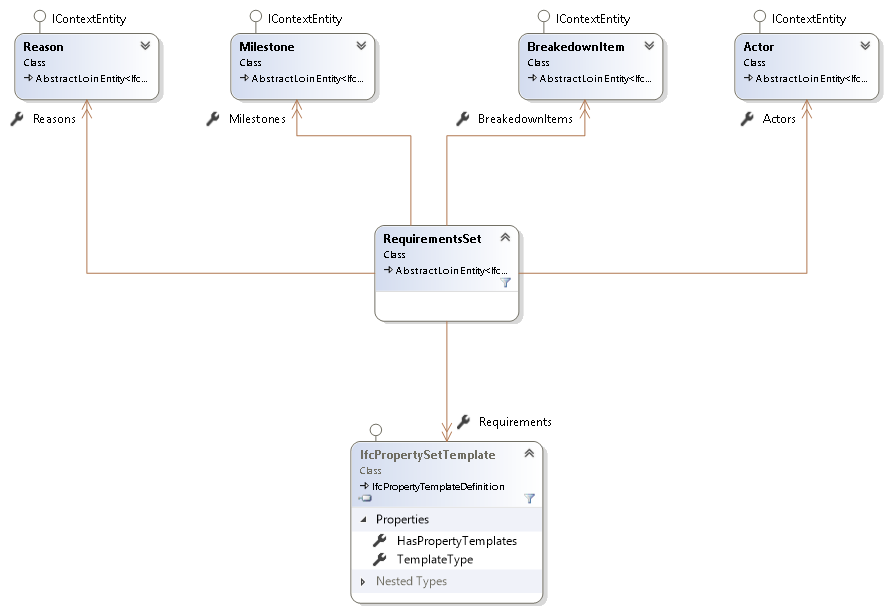
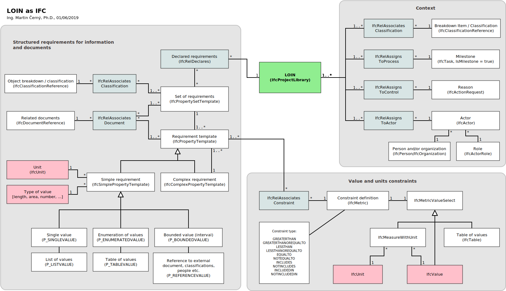

# DSS Tools

[](https://dev.azure.com/KoncepceBIM/DSSTools/_build/latest?definitionId=1&branchName=master)

Library available as a [NuGet package](https://www.nuget.org/packages/LOIN/)
```ps
Install-Package LOIN -Version 1.0.102
```

One possible way to browse requirements in their context

```cs
using (var model = Model.Open(file))
{
    foreach (var item in model.BreakdownStructure)
    {
        foreach (var milestone in model.Milestones)
        {
            foreach (var actor in model.Actors)
            {
                foreach (var reason in model.Reasons)
                {
                    var requirementSets = 
                        model.GetRequirements(item, milestone, actor, reason)
                        .SelectMany(r => r.Requirements)
                        .ToList();
                    if (!requirementSets.Any())
                        continue;

                    Console.WriteLine();
                    Console.WriteLine("CONTEXT:");
                    Console.WriteLine($"  Breakdown Item: {item.Name}");
                    Console.WriteLine($"  Milestone: {milestone.Name}");
                    Console.WriteLine($"  Actor: {actor.Name}");
                    Console.WriteLine($"  Reason: {reason.Name}");

                    foreach (var requirementSet in requirementSets.Where(r => r.HasPropertyTemplates.Any()))
                    {
                        Console.WriteLine($"    Requirement set: {requirementSet.Name}");
                        foreach (var requirement in requirementSet.HasPropertyTemplates)
                        {
                            Console.WriteLine($"    Requirement: {requirement.Name} ({requirement.Description})");
                        }
                    }
                }
            }
        }
    }
}

```

This library provides simplified access to requirements defined according to LOIN methodology in IFC.

Following diagram shows access objects structure:


This is how LOIN is expressed in IFC using this library:


This if how this library can be used to create Level of Information Need as IFC:

```cs
// details of the creator and the application
var editor = new XbimEditorCredentials
{
    ApplicationDevelopersName = "TC442 WG2 TG1",
    ApplicationFullName = "Level of Information Need Sample",
    ApplicationIdentifier = "LOIN",
    ApplicationVersion = "1.0",
    EditorsFamilyName = "Cerny",
    EditorsGivenName = "Martin",
    EditorsOrganisationName = "Czech Standardization Agency"
};

// IFC wrapper model
using var model = Model.Create(editor);
using var txn = model.Internal.BeginTransaction("Level of Information Need specification");
var ifc = model.Internal.Instances;

// root object to hold Level of Information Need requirements
var requirements = model.CreateRequirementSet("LOIN-C Issued for Construction DP A", "Level of Information need - Issued for Construction for Architectural Design - Design Package A");

// prerequisities
var purpose = model.CreatePurpose("Design review", "Review of detailed design information");
var appointingParty = model.CreateActor("Design Lead", "Person responsible for the coordination of design disciplines");
var appointedParty = model.CreateActor("Archtect-Engineer (AE)", "Person providing joint architectural-engineering services");
var milestone = model.CreateMilestone("Design Package A", "First design package to be issued for construction");
var item = model.CreateBreakedownItem("Suspended ceiling", "2RBXAUzUb4jxhBy1TJPbpm", "a secondary ceiling, hung below the main ceiling");

// assign requirements to prerequisities
purpose.AddToContext(requirements);
appointingParty.AddToContext(requirements, "APPOINTING_PARTY"); // actor in a role
appointedParty.AddToContext(requirements, "APPOINTED_PARTY");  // actor in a role
milestone.AddToContext(requirements);
item.AddToContext(requirements);
purpose.AddToContext(requirements);

// geometry requirements
var geomReq = model.CreateGeometryRequirements();
geomReq.ID = Guid.NewGuid().ToString();
geomReq.Name = "Geometrical information issued for construction relative offset";
geomReq.Definition = "Geometrical information for objects with relative height offset; to be issued for construction";
geomReq.Detailing = Requirements.DetailingEnum.HighDetail;
geomReq.Dimensionality = Requirements.DimensionalityEnum.Dim_3D;
geomReq.Appearance = "No texture";
geomReq.ParametricBehaviour = "parametric geometry";

requirements.Add(geomReq);

// aplha-numeric requirements
var alphaNumericRequirements = model.CreatePropertySetTemplate("suspended ceiling characteristics", "Suspended ceiling characteristics necessary for commence of construction")
    .SetId("1bMoDf5wDDPRdm3Z3IBzbF");
requirements.Add(alphaNumericRequirements);

var thermalConductivity = model.CreateSimplePropertyTemplate("design thermal conductivity according to ISO 10456", null, nameof(IfcThermalConductivityMeasure))
    .SetId("0zqubcVzf7EB2eIHdprthv");
alphaNumericRequirements.HasPropertyTemplates.Add(thermalConductivity);

var loadOfMetal = model.CreateSimplePropertyTemplate("admissible load of metal suspension according to EN 13964", null, nameof(IfcForceMeasure), ifc.New<IfcSIUnit>(u => {
    u.UnitType = Xbim.Ifc4.Interfaces.IfcUnitEnum.FORCEUNIT;
    u.Name = Xbim.Ifc4.Interfaces.IfcSIUnitName.NEWTON;
}))
    .SetId("1gn5hadEL1ixoXBYdHALsC")
    .SetConstraint(new IfcForceMeasure(900.0), Xbim.Ifc4.Interfaces.IfcBenchmarkEnum.GREATERTHAN);
alphaNumericRequirements.HasPropertyTemplates.Add(loadOfMetal);

var reactionToFire = model.CreateSimplePropertyTemplate("reaction to fire classification of substructure according to EN 13501-1", null, nameof(IfcIdentifier))
    .SetId("1ZVre0Sbz6RfbGBJD4Bnip")
    .SetConstraint(new IfcIdentifier("A1"), Xbim.Ifc4.Interfaces.IfcBenchmarkEnum.EQUALTO)
    .MakeEnumerated("reaction to fire classification", "A1", "A2", "A3", "A4", "A5");
alphaNumericRequirements.HasPropertyTemplates.Add(reactionToFire);

var manufacturer = model.CreateSimplePropertyTemplate("manufacturer", null, nameof(IfcIdentifier))
    .SetId("3uaKQyxxj2gwHI3oQk3Sci");
alphaNumericRequirements.HasPropertyTemplates.Add(manufacturer);


// document requirements
var documentRequirements = model.CreatePropertySetTemplate("Documentation for suspended ceilings - DPA", "Required Documentation for suspended ceilings at design package A");
requirements.Add(documentRequirements);

var installInstructions = model.CreateDocumentPropertyTemplate("Installation instruction", "Manufacturer's installation instruction");
documentRequirements.HasPropertyTemplates.Add(installInstructions);

var DoP = model.CreateDocumentPropertyTemplate("DoP", "Manufacturer's declaration of performance");
documentRequirements.HasPropertyTemplates.Add(DoP);

var ceilingDetail = model.CreateDocumentPropertyTemplate("Detail wall-ceiling", "Detail for the connection between the wall and the ceiling");
documentRequirements.HasPropertyTemplates.Add(ceilingDetail);

var expJoinDetail = model.CreateDocumentPropertyTemplate("Detail expansion joint", "Detail for expansion joint");
documentRequirements.HasPropertyTemplates.Add(expJoinDetail);

// commit changes
txn.Commit();

// serialize as IFC
model.Save("LevelOfInformationNeed_Sample1.ifc");

// serialize as IFC XML
model.Save("LevelOfInformationNeed_Sample1.ifcXML");
```

Resulting files:
  - [LevelOfInformationNeed_Sample1.ifc](Examples/LevelOfInformationNeed_Sample1.ifc)
  - [LevelOfInformationNeed_Sample1.ifcxml](Examples/LevelOfInformationNeed_Sample1.ifcxml)