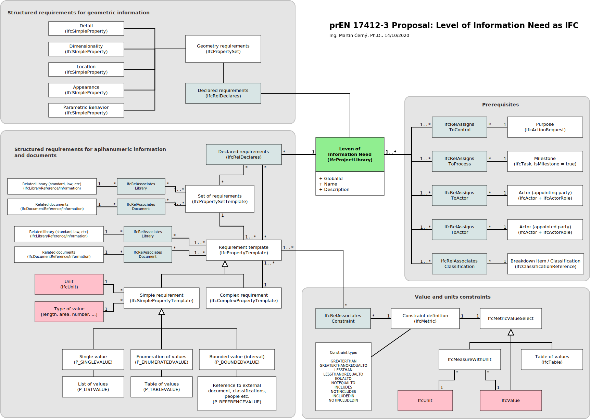

# DSS Tools
Build status: [](https://dev.azure.com/KoncepceBIM/DSSTools/_build/latest?definitionId=1&branchName=master)

Library available as a NuGet package
```ps
Install-Package LOIN -Version 1.0.102
```

One possible way to browse requirements in their context

```cs
using (var model = Model.Open(file))
{
    foreach (var item in model.BreakdownStructure)
    {
        foreach (var milestone in model.Milestones)
        {
            foreach (var actor in model.Actors)
            {
                foreach (var reason in model.Reasons)
                {
                    var requirementSets = 
                        model.GetRequirements(item, milestone, actor, reason)
                        .SelectMany(r => r.Requirements)
                        .ToList();
                    if (!requirementSets.Any())
                        continue;

                    Console.WriteLine();
                    Console.WriteLine("CONTEXT:");
                    Console.WriteLine($"  Breakdown Item: {item.Name}");
                    Console.WriteLine($"  Milestone: {milestone.Name}");
                    Console.WriteLine($"  Actor: {actor.Name}");
                    Console.WriteLine($"  Reason: {reason.Name}");

                    foreach (var requirementSet in requirementSets.Where(r => r.HasPropertyTemplates.Any()))
                    {
                        Console.WriteLine($"    Requirement set: {requirementSet.Name}");
                        foreach (var requirement in requirementSet.HasPropertyTemplates)
                        {
                            Console.WriteLine($"    Requirement: {requirement.Name} ({requirement.Description})");
                        }
                    }
                }
            }
        }
    }
}

```

This library provides simplified access to requirements defined according to LOIN methodology in IFC.

Following diagram shows access objects structure:


This is how LOIN is expressed in IFC using this library:
